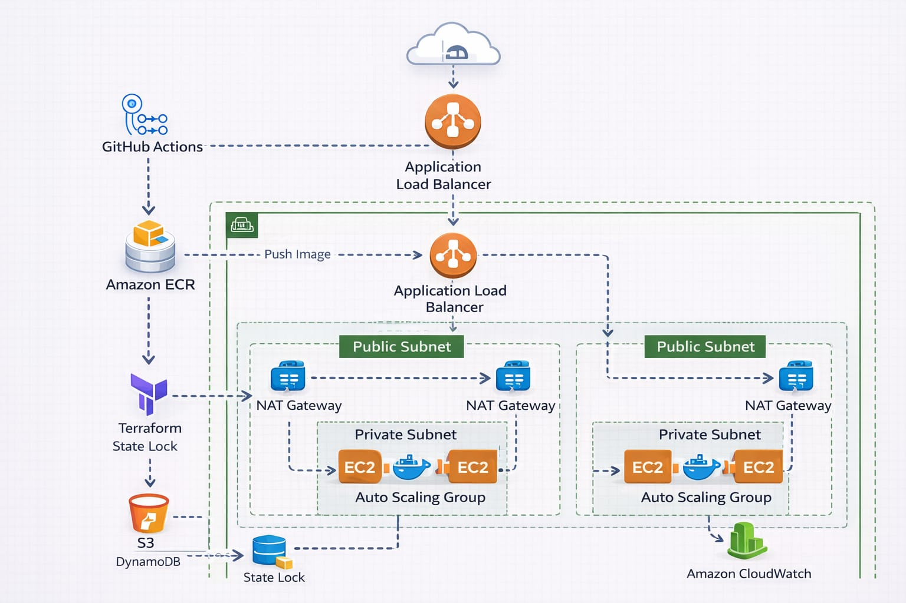
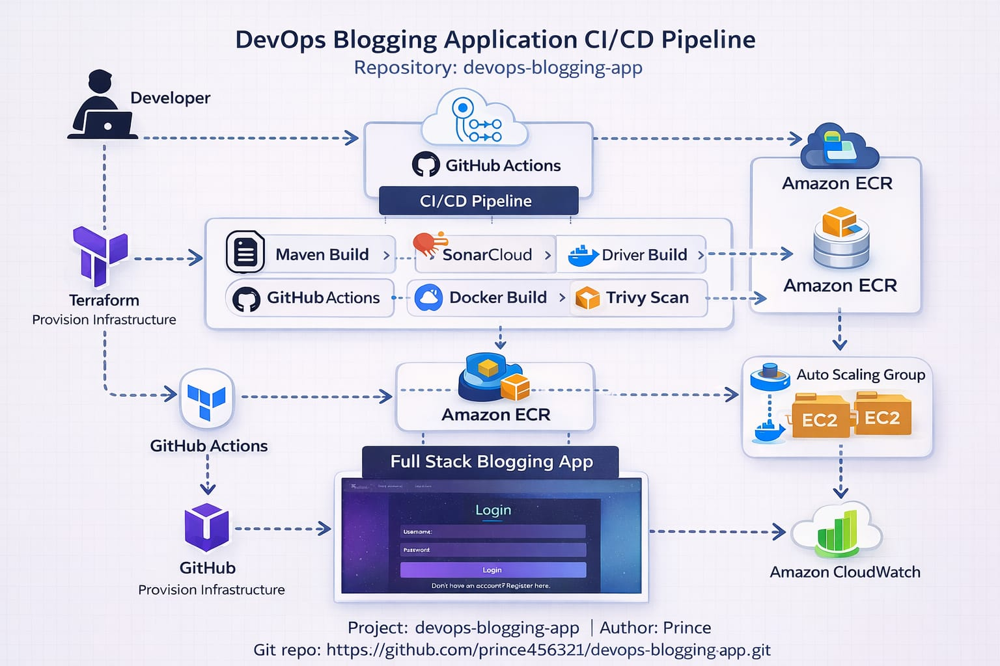
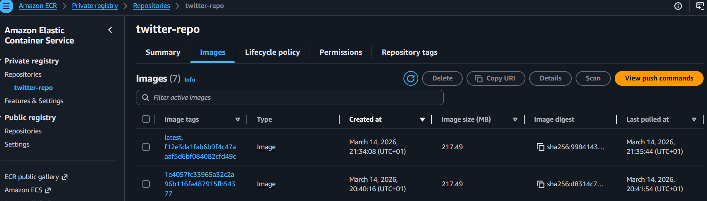
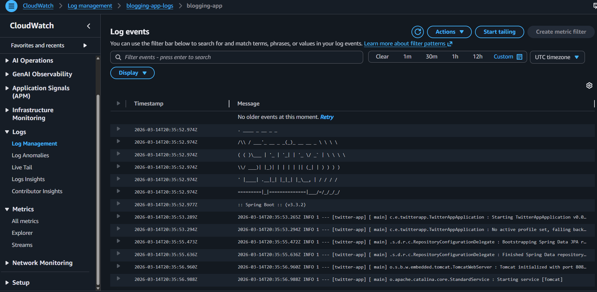
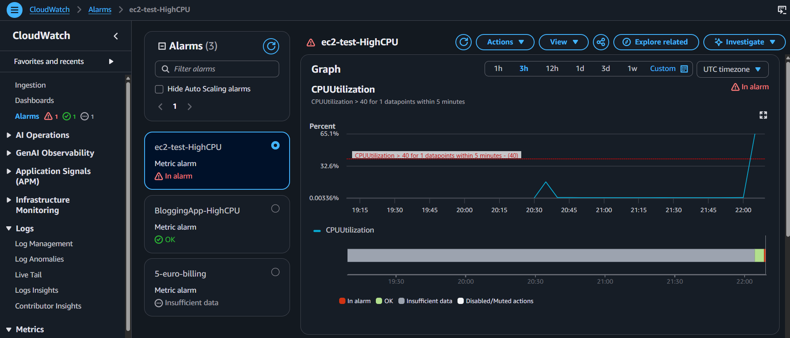
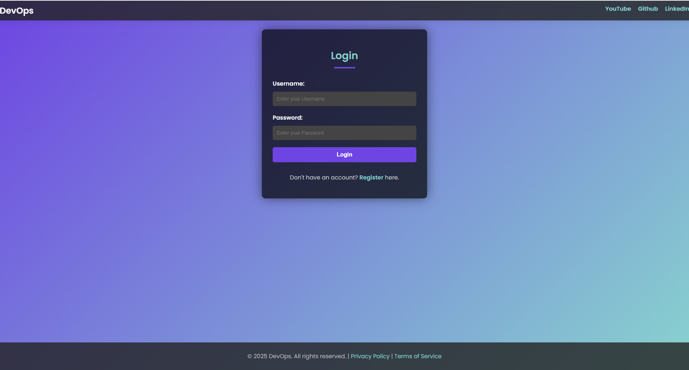

# DevOps Blogging Application

This project demonstrates a complete DevOps deployment pipeline including:

- Docker containerization
- AWS infrastructure
- Terraform infrastructure as code
- GitHub Actions CI/CD pipeline
- Auto Scaling deployment
- Application Load Balancer


# DevOps Blogging Application Deployment


---

## Project Overview

This project demonstrates a complete DevOps workflow for deploying a containerized Spring Boot application on AWS using Infrastructure as Code and CI/CD automation.

The project includes:

- Infrastructure provisioning with Terraform
- Containerization with Docker
- CI/CD pipeline using GitHub Actions
- Deployment using EC2 Auto Scaling Groups
- Monitoring and logging using CloudWatch

---

## Tech Stack

- **Cloud Provider:** AWS
- **Infrastructure as Code:** Terraform
- **Containerization:** Docker
- **CI/CD:** GitHub Actions
- **Container Registry:** Amazon ECR
- **Compute:** EC2 Auto Scaling Group
- **Load Balancing:** Application Load Balancer
- **Monitoring:** Amazon CloudWatch
- **Logging:** CloudWatch Logs
- **Application:** Spring Boot

---

## Key DevOps Features

- Infrastructure fully provisioned using **Terraform**
- Automated **CI/CD pipeline** with GitHub Actions
- Docker image build and push to **Amazon ECR**
- Automatic deployment to **EC2 instances**
- **Auto Scaling Group** for high availability
- **Application Load Balancer** for traffic distribution
- Centralized logging using **CloudWatch Logs**
- **CloudWatch CPU alarms** for monitoring and alerting

---

## Architecture



### Architecture Explanation

User traffic is first routed through an **Application Load Balancer (ALB)** which distributes incoming requests across multiple EC2 instances.
These instances are managed by an **Auto Scaling Group (ASG)** that automatically adjusts the number of running instances depending on the system load and health status.

Each EC2 instance runs a **Docker container** hosting the **Spring Boot application**, ensuring consistent and portable deployments.

The **CI/CD pipeline** is implemented using **GitHub Actions**.
Whenever code is pushed to the GitHub repository, the pipeline automatically builds a Docker image and pushes it to **Amazon Elastic Container Registry (ECR)**.

During deployment, EC2 instances pull the latest container image from **Amazon ECR** and start the updated application container.

For monitoring and observability, **CloudWatch Logs** collect application logs from the running containers, while **CloudWatch CPU alarms** monitor instance utilization and trigger alerts when predefined thresholds are exceeded.        


---

## CI/CD Pipeline

The CI/CD pipeline automatically builds and deploys the application when code is pushed to the repository.

Steps:

1. Build Docker image
2. Tag image with commit SHA
3. Push image to Amazon ECR
4. Deploy new version
5. Refresh Auto Scaling Group instances



---

## Infrastructure as Code

Infrastructure is fully managed using Terraform.

Resources created:

- VPC
- Subnets
- Security Groups
- Application Load Balancer
- Launch Template
- Auto Scaling Group
- CloudWatch Alarms
- CloudWatch Log Groups

---

## Container Registry

Docker images are stored in Amazon ECR.



---

## Monitoring and Logging

Monitoring is implemented using Amazon CloudWatch.

Features:

- CPU utilization alarm
- Centralized container logs
- Real-time log monitoring



---

## Alarm Example

CloudWatch alarm configured for high CPU usage.



---




## How to Reproduce

---

## Configuration Required

Before reproducing this project, some values must be replaced with your own AWS and SonarCloud configuration.
This ensures that the infrastructure and CI/CD pipeline run correctly in your own AWS account.

---

## AWS Account ID

Replace the AWS Account ID anywhere you see an ECR URL like:

123456789012.dkr.ecr.us-east-1.amazonaws.com

Replace `123456789012` with **your own AWS Account ID**.

This value is used in:

- GitHub Actions workflow
- Docker image push commands
- ECR login commands

You can find your AWS Account ID in the AWS console.

---

## AWS Region

The default region used in this project is:

us-east-1

If you want to deploy in another region, you can replace it with something like:

eu-central-1

Make sure the region you choose matches the region where your AWS resources are created.

---

## ECR Repository

The pipeline pushes Docker images to Amazon ECR.

The default repository name used in this project is:

twitter-repo

Before running the pipeline, create the repository in AWS:

aws ecr create-repository --repository-name twitter-repo

If you use another repository name, update the value in the GitHub Actions workflow.

---

## SonarCloud Configuration

This project uses **SonarCloud** for code quality analysis.

You must replace the following values with your own SonarCloud configuration.

### Sonar Project Key

Example value used in this project:

prince456321_devops-blogging-app

Replace it with your own SonarCloud project key.

---

### Sonar Organization

Example value used in this project:

princesonarqube

Replace it with your own SonarCloud organization name.

---

## Terraform Backend Configuration

Terraform remote state is stored using:

- Amazon **S3** (for the Terraform state file)
- **DynamoDB** (for state locking)

You must create these resources in your AWS account.

Example resources:

S3 Bucket: terraform-state-bucket
DynamoDB Table: terraform-lock-table

These resources prevent:

- Terraform state corruption
- concurrent Terraform execution
- infrastructure conflicts

---

## GitHub Secrets

The CI/CD pipeline requires several GitHub secrets.

Add them in your repository settings:

Repository → Settings → Secrets and variables → Actions

Create the following secrets:

AWS_ACCESS_KEY_ID
AWS_SECRET_ACCESS_KEY
AWS_ACCOUNT_ID
SONAR_TOKEN

These secrets are used by GitHub Actions to:

- authenticate with AWS
- push Docker images to Amazon ECR
- run SonarCloud analysis

---

## Required AWS Resources

Before running the project, make sure the following resources exist:

- Amazon **ECR Repository**
- **S3 bucket** for Terraform state
- **DynamoDB table** for Terraform state locking
- **SonarCloud project**
- **SonarCloud token**
- **GitHub secrets**

---

## Important Notes

This project was designed to be **reproducible in any AWS account**.

However, the following values **must always be replaced** with your own configuration:

- AWS Account ID
- AWS Region (optional)
- ECR repository name
- SonarCloud project key
- SonarCloud organization
- Terraform backend resources
- GitHub Secrets

---

## Documentation

Detailed documentation explaining how to reproduce the entire project is available in the PDF guide below.

- í³˜ *Project Setup Guide*


This document contains:

- prerequisites
- AWS configuration
- Terraform backend setup
- GitHub secrets configuration
- SonarCloud setup
- CI/CD pipeline execution
- deployment steps

---
Clone the repository:
https://github.com/prince456321/devops-blogging-app.git


```bash
git clone https://github.com/YOUR_USERNAME/devops-blogging-app.git
cd devops-blogging-app
terraform init
terraform apply

Push changes to trigger the CI/CD Pipeline

git add .
git commit -m "update"
git push origin main
---


